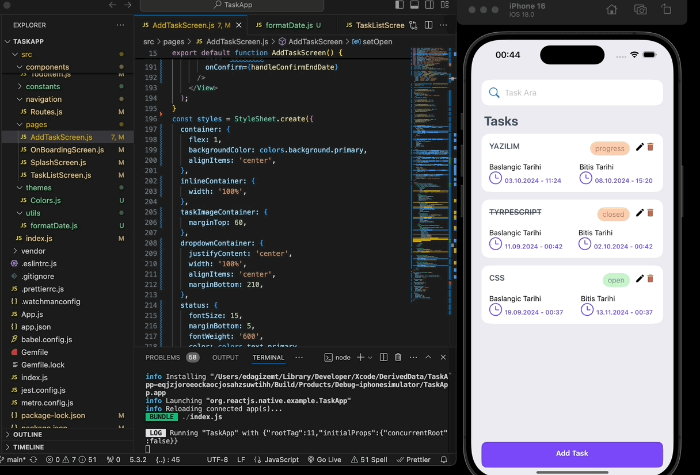

<h1>Task App</h1>

Yukarıda yazmış olduğunuz React Native task yönetim uygulaması, kullanıcıların görev oluşturmasına, düzenlemesine ve güncellemesine olanak tanıyan basit bir yapılacaklar listesi uygulamasıdır. Uygulama, görevlerin başlangıç ve bitiş tarihlerini seçebilme, görev durumunu belirleyebilme gibi işlevleri destekler.

### Özellikler ve Teknik Detaylar:
1. **Görev Oluşturma ve Güncelleme**: 
   - Kullanıcılar bir görev adı, başlangıç ve bitiş tarihleri belirleyerek yeni bir görev ekleyebilir. Var olan görevler güncellenebilir.
   - Eğer bir görev düzenleniyorsa, güncelleme işlemi yapılır, değilse yeni bir görev eklenir.
   - Görevlerin benzersiz bir kimliği (UUID) vardır, bu sayede her görev birbirinden ayırt edilir.

2. **Durum Seçimi**: 
   - Kullanıcılar, her görev için bir durum belirleyebilir. Görev durumu, bir açılır menü (DropDownPicker) kullanılarak seçilir. Durumlar şunlardır: **Open (Açık), Progress (Devam Ediyor), Pending (Beklemede), Closed (Kapalı)**.

3. **AsyncStorage Kullanımı**: 
   - Görevler, cihazın yerel depolama alanında (AsyncStorage) saklanır. Bu sayede uygulama kapandığında bile görevler kaybolmaz ve tekrar açıldığında kaldığı yerden devam eder.
   - Yeni bir görev eklenirken veya güncellenirken mevcut görevler AsyncStorage'dan okunur, güncellenir ve tekrar kaydedilir.

4. **Tarih Seçimi**: 
   - Başlangıç ve bitiş tarihleri, `react-native-modal-datetime-picker` kullanılarak seçilir. Kullanıcı, tarih seçim ekranından görev için bir başlangıç ve bitiş tarihi seçebilir.

5. **Lottie Animasyonları**: 
   - Görev oluşturma veya düzenleme ekranında, bir Lottie animasyonu kullanılarak görsel zenginlik sağlanır. Bu animasyon, uygulamaya dinamik bir hava katmakta ve kullanıcı deneyimini iyileştirmektedir.

6. **Toast Mesajları**: 
   - Kullanıcı, başarılı veya başarısız işlem durumunda ekranın üst kısmında bilgilendirme mesajları alır. Örneğin, bir görev başarıyla eklendiğinde veya eksik bilgi olduğunda uyarı mesajı çıkar.

7. **Navigasyon**: 
   - Uygulama, `react-navigation` kütüphanesini kullanarak ekranlar arasında geçiş yapar. Görev listesi ekranından yeni görev ekleme ekranına ya da düzenleme ekranına sorunsuz bir geçiş sağlanır.

8. **Custom Bileşenler**: 
   - Uygulamada tekrarlayan işlemler için özel bileşenler (`CustomTextInput`, `CustomButton`) tanımlanmıştır. Bu bileşenler, UI'yı daha modüler hale getirir ve kod tekrarını azaltır.

### Genel İşleyiş:
Kullanıcı, görev listesi ekranında bir görev ekleme düğmesine tıklayarak yeni görev ekleme ekranına yönlendirilir. Burada, görev için bir başlık girer, başlangıç ve bitiş tarihlerini seçer ve görevin durumunu belirler. Bilgiler tamamlandıktan sonra, "Save Task" düğmesine basıldığında görev, yerel depolamaya (AsyncStorage) kaydedilir ve kullanıcı görev listesine geri yönlendirilir. Eğer mevcut bir görev düzenleniyorsa, bilgiler otomatik olarak doldurulur ve güncelleme işlemi yapılır.

Bu uygulama, temel görev yönetimi fonksiyonlarını yerine getiren, kullanıcı dostu ve kolayca genişletilebilecek bir yapıya sahiptir.